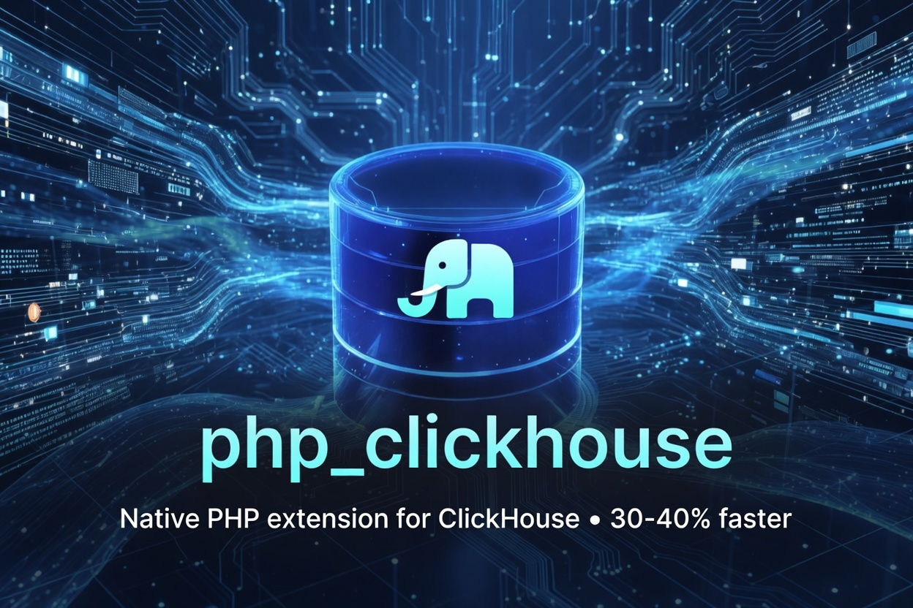

# php_clickhouse

[](https://github.com/iliaal/php_clickhouse/actions/workflows/tests.yml)
[](https://github.com/iliaal/php_clickhouse/releases)
[](http://www.php.net/license/3_01.txt)
[](https://x.com/intent/follow?screen_name=iliaa)



Native PHP extension for [ClickHouse](https://clickhouse.com/), built on the official [ClickHouse/clickhouse-cpp](https://github.com/ClickHouse/clickhouse-cpp) v2.6.2 client. Speaks the native binary TCP protocol with LZ4 / ZSTD compression and optional TLS, picking up where [SeasX/SeasClick](https://github.com/SeasX/SeasClick) left off in 2020. 1.5-4x faster than a pure-PHP HTTP client depending on workload shape, with modern types (Date32, Time64, Decimal128, LowCardinality, Map, JSON), multi-endpoint failover, and structured exceptions.

## 📖 Documentation

The full guide lives at [iliaal.github.io/php_clickhouse](https://iliaal.github.io/php_clickhouse/). It covers every supported type (what `insert()` accepts and what `select()` returns), `fetch_mode` flags, CSV/TSV streaming, placeholders, settings, observability, and the complete method list. This README is the quick start.

## Why this fork?

[SeasX/SeasClick](https://github.com/SeasX/SeasClick) was the standard native PHP ClickHouse extension until it stopped accepting PRs in 2020; several PRs there have been pending for years. This fork:

- Renames the extension to `php_clickhouse` (module `clickhouse`, classes `ClickHouse` / `ClickHouseException`)
- Upgrades the vendored client from artpaul-fork v1.x to the official ClickHouse/clickhouse-cpp v2.6.2
- Adds Date32 / Time / Time64 / DateTime64 / Int128 / UInt128 / Decimal128 / LowCardinality / Map / JSON column types, multi-endpoint failover, ZSTD compression, query_id propagation, and TLS
- Ships an updated test suite, CI, PIE-based packaging, and benchmarks

The original `SeasClick` and `SeasClickException` class names continue to work as deprecated aliases. Method signatures, return types, and class properties are declared with PHP types via a stub-driven arginfo workflow, so reflection, IDE completion, and static analyzers see the typed surface.

## 🚀 Install

Via [PIE](https://github.com/php/pie) (the PHP Foundation's PECL successor):

```sh
pie install iliaal/php_clickhouse
```

With TLS support:

```sh
pie install iliaal/php_clickhouse --enable-clickhouse-openssl
```

> Bare `php:X.Y-cli` Docker images lack `/usr/bin/unzip`, which composer needs to extract PIE's prebuilt `.so` zip. Run `apt-get install -y unzip` before `pie install`, otherwise composer falls back to PHP's ZipArchive and PIE fails with `ExtensionBinaryNotFound`. Host installs that already have `unzip` are fine.

Building from source:

```sh
git clone https://github.com/iliaal/php_clickhouse.git
cd php_clickhouse
phpize
./configure                              # default build
./configure --enable-clickhouse-openssl  # with TLS, requires OpenSSL development headers
                                         #   (libssl-dev on Debian/Ubuntu, openssl-devel
                                         #    on RHEL/Fedora, openssl-dev on Alpine)
make && sudo make install
```

Add `extension=clickhouse.so` to your `php.ini`. The build needs a C++17-capable compiler (GCC 8+, Clang 7+, MSVC 2019+); LZ4, ZSTD, abseil-int128, and CityHash are vendored under `lib/clickhouse-cpp/contrib/`.

### Platforms

| Platform | Status | Notes |
|----------|--------|-------|
| Linux NTS | primary | PHP 7.4 through 8.5, CI matrix |
| Linux ZTS | supported | PHP 7.4 through 8.5, full CI matrix; PIE source builds |
| Windows (NTS, TS) | supported | PHP 8.3 through 8.5, x86 / x64 release matrix with offline load tests; pre-built `.dll` assets |
| macOS arm64 NTS | build-verified | PHP 8.4 and 8.5 release lane; pre-built binaries, no ClickHouse runtime test |

Per-Client state lives on the `zend_object` itself (custom `create_object` / `free_obj` handlers), so ZTS works without locking. There is no module-global state to thread-isolate.

### Test server

For development and integration tests, run the official ClickHouse server image:

```sh
docker run -d --name clickhouse-test \
    --ulimit nofile=262144:262144 \
    -p 9000:9000 -p 8123:8123 -p 9440:9440 \
    -e CLICKHOUSE_USER=test \
    -e CLICKHOUSE_PASSWORD=test \
    -e CLICKHOUSE_DB=test \
    clickhouse/clickhouse-server:latest
```

Stop and clean up: `docker rm -f clickhouse-test`.

## 🛠️ Quick example

```php
<?php
$ch = new ClickHouse([
    "host"        => "127.0.0.1",
    "port"        => 9000,
    "database"    => "test",
    "user"        => "test",
    "passwd"      => "test",
    "compression" => "lz4",   // or "zstd" / true / false
]);

$ch->execute("CREATE TABLE IF NOT EXISTS events (
    id UInt32, ts DateTime64(3), tag LowCardinality(String)
) ENGINE = Memory");

$ch->insert("events", ["id", "ts", "tag"], [
    [1, time(), "alpha"],
    [2, time(), "beta"],
]);

foreach ($ch->select("SELECT id, ts, tag FROM events ORDER BY id",
                     [], ClickHouse::DATE_AS_STRINGS) as $row) {
    print_r($row);
}
```

## 🧭 API surface

| Area | Methods |
|---|---|
| Reading | `select`, `selectWithExternalData`, `selectStream`, `selectStreamCallback`, `selectStatement`, `selectToStream` |
| Writing | `insert`, `insertAssoc`, `insertFromStream`, `writeStart`, `write`, `writeEnd` |
| Result wrapper (`ClickHouseStatement`) | `fetchOne`, `fetchKeyPair`, `fetchColumn`, `toArray`, `statistics` (+ `Iterator` / `ArrayAccess` / `JsonSerializable`) |
| Config & observability | `setSettings`, `setSetting`, `setDatabase`, `setProgressCallback`, `setProfileCallback`, `setVerbose`, `getStatistics`, `enableLogQueries`, `getLogQueries`, `resetConnection` |
| DDL & introspection | `execute`, `ping`, `isExists`, `showDatabases`, `showTables`, `showCreateTable`, `getServerVersion`, `getServerUptime`, `getServerInfo`, `getCurrentEndpoint`, `databaseSize`, `tablesSize`, `tableSize`, `partitions`, `truncateTable`, `dropPartition` |

| Flag | Value | Effect |
|---|---|---|
| `FETCH_ONE` | 1 | first cell of the first row, as a scalar |
| `FETCH_KEY_PAIR` | 2 | column 0 → column 1 map |
| `DATE_AS_STRINGS` | 4 | dates / datetimes as formatted strings |
| `FETCH_COLUMN` | 8 | flat list of column 0 |
| `JSON_AS_ARRAY` | 16 | `JSON` cells decode to assoc arrays |
| `JSON_AS_OBJECT` | 32 | `JSON` cells decode to `stdClass` |
| `UUID_WITH_DASHES` | 64 | hyphenated UUIDs |
| `FIXEDSTRING_BINARY` | 128 | full N-byte `FixedString`, trailing NULs kept |
| `MAP_AS_PAIRS` | 256 | `Map` as ordered `[key, value]` pairs |

Shape flags (`FETCH_ONE` / `FETCH_KEY_PAIR` / `FETCH_COLUMN`) are ignored on `selectStatement` / `selectStream` / `selectStreamCallback`; only value flags apply there. See the [documentation site](https://iliaal.github.io/php_clickhouse/) for full signatures and streaming formats.

The `passwd` key also accepts the `password` alias. Returning `false` from a `selectStreamCallback()` callback stops the stream cleanly.

## 📊 Benchmarks

PHP 8.4.23 / ClickHouse 26.6.2.81 / localhost loopback / `Memory` table (no disk).

Compared against [smi2/phpClickHouse](https://github.com/smi2/phpClickHouse), the most popular pure-PHP HTTP client. Each cell is the median of four runs and measures one bulk insert plus `selectCount` queries. Setup, reset, and warm-up are untimed; client order rotates between runs.

This is native binary TCP on port 9000 against JSON over HTTP on port 8123, so it measures the protocol as much as the library. HTTP compression is left at the client's default (off) while two of the extension columns are compressed; a gzip-enabled HTTP column is tracked in [`bench/README.md`](bench/README.md).

| dataCount × selectCount × limit | phpClickHouse (HTTP) | php_clickhouse (uncompressed) | php_clickhouse (LZ4) | php_clickhouse (ZSTD) |
|---|---:|---:|---:|---:|
| 10000 × 1 × 5000 | 0.088 | 0.060 | 0.060 | 0.058 |
| 10000 × 100 × 5000 | 1.092 | 0.332 | 0.300 | 0.294 |
| 10000 × 100 × 10000 | 1.920 | 0.471 | 0.464 | 0.454 |
| 1000 × 200 × 500 | 0.681 | 0.327 | 0.324 | 0.366 |
| 1000 × 500 × 1000 | 2.245 | 0.880 | 0.894 | 0.876 |

To reproduce the controlled comparison, see [`bench/`](bench/).

## 🔗 Native PHP extensions

Companion native PHP extensions:

- **[php_excel](https://github.com/iliaal/php_excel)**: native Excel I/O via LibXL. 7-10× faster than PhpSpreadsheet, full XLS/XLSX with formulas, formatting, and styling.
- **[mdparser](https://github.com/iliaal/mdparser)**: native CommonMark + GFM markdown parser via md4c. 15-30× faster than pure-PHP libraries.
- **[pdo_duckdb](https://github.com/iliaal/pdo_duckdb)**: PDO driver for DuckDB, analytical SQL in your PHP stack.
- **[fastjson](https://github.com/iliaal/fastjson)**: drop-in faster `ext/json`, backed by yyjson. 6× encode, 2.7× decode, 5× validate.
- **[phpser](https://github.com/iliaal/phpser)**: decoder-optimized binary serializer for cache workloads. Faster than igbinary on packed numerics and DTO batches.
- **[fast_uuid](https://github.com/iliaal/fast_uuid)**: high-throughput UUID generation (v1/v4/v7), batched CSPRNG and SIMD hex formatter, ramsey-compatible API.
- **[fastchart](https://github.com/iliaal/fastchart)**: native chart-rendering extension. 38 chart types behind one fluent OO API, SVG-canonical with PNG/JPG/WebP and optional PDF output.
- **[statgrab](https://github.com/iliaal/statgrab)**: system statistics (CPU, memory, disk, network) via libstatgrab, no parsing /proc by hand.
- **[phonetic](https://github.com/iliaal/phonetic)**: native phonetic name matching (Double Metaphone, Beider-Morse, Daitch-Mokotoff, NYSIIS, Match Rating), the encoders PHP core lacks.

## 📚 Read more

The launch post covers the fork rationale and benchmark methodology: [php_clickhouse: A Native ClickHouse Client for PHP, Picking Up Where SeasClick Left Off](https://ilia.ws/blog/php-clickhouse-a-native-clickhouse-client-for-php-picking-up-where-seasclick-left-off).

## License

The PHP-side wrapper is licensed under [PHP-3.01](LICENSE).

The vendored client library at `lib/clickhouse-cpp/` is [ClickHouse/clickhouse-cpp](https://github.com/ClickHouse/clickhouse-cpp), licensed under the [Apache License 2.0](lib/clickhouse-cpp/LICENSE).

The vendored compression libraries (`lib/clickhouse-cpp/contrib/lz4/`, `contrib/zstd/`, `contrib/cityhash/`) carry BSD-style licenses; abseil int128 (`contrib/absl/`) is Apache 2.0. See each subdirectory for the exact text.

## Credits

`php_clickhouse` started as a fork of [SeasX/SeasClick](https://github.com/SeasX/SeasClick) by SeasX Group (`ahhhh.wang@gmail.com`). The original PR-4 work to add fetch modes landed in 2019 and the upstream maintainer hasn't accepted external PRs since. Independent re-vendoring, port to clickhouse-cpp v2.6.2, new types, TLS, and packaging are by Ilia Alshanetsky <ilia@ilia.ws>.

## Contributing

See [CONTRIBUTING.md](CONTRIBUTING.md). Security issues: [SECURITY.md](SECURITY.md).

---

[Follow @iliaa on X](https://x.com/iliaa) • [Blog](https://ilia.ws) • If this sped up your stack, ⭐ star it!
